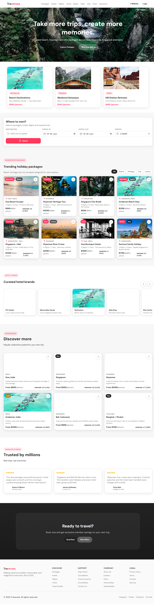

# Traversea — Travel Booking Platform

Traversea is a MakeMyTrip-inspired travel booking platform built with **React + Vite** and an **Express** backend. The frontend focuses on curated travel packages, hotel brands, destination collections, and a search-led booking flow across **Goa, Myanmar, Singapore**, and more.

## Screenshot



## Tech Stack

- Frontend: React + Vite
- Styling: Vanilla CSS with Airbnb-inspired warm design system
- Icons: Lucide React
- Backend: Express + CORS

## Features

- Sticky nav with brand, categories, wishlist, and login
- Hero section with headline and primary CTAs
- Search form for destination, check-in, check-out, and guests
- Category picker cards: Beach Destinations, Weekend Getaways, Hill Station Retreats
- Trending holiday packages with filter chips: All, Beach, Heritage, City, Luxury
- Package cards with wishlist toggles, pricing, ratings, and book actions
- Curated hotel brands carousel with previous/next navigation
- Discover more destination/experience cards with prices and ratings
- Testimonials section
- Functional footer with site links and branding

## Getting Started

### Frontend

```bash
cd frontend
npm install
npm run dev
```

Open http://localhost:5173

### Backend

```bash
cd backend
npm install
npm run dev
```

Server runs on http://localhost:3001

## Project Structure

- `frontend/` — React app
  - `src/components/` — UI components
  - `src/pages/` — page layouts
  - `src/data/` — package, hotel, destination, and testimonial data
  - `src/assets/styles/` — design system styles
- `backend/` — Express API scaffold
- `docs/` — screenshots and project assets

## Design System

- Accent color: Rausch Red `#ff385c`
- Font: DM Sans
- Layout: Airbnb-style card grid, warm neutrals, rounded components

## Status

This repo contains the implemented frontend scaffold and functional interactive buttons. Backend endpoints and advanced booking flows are planned under `Phases.md`.
